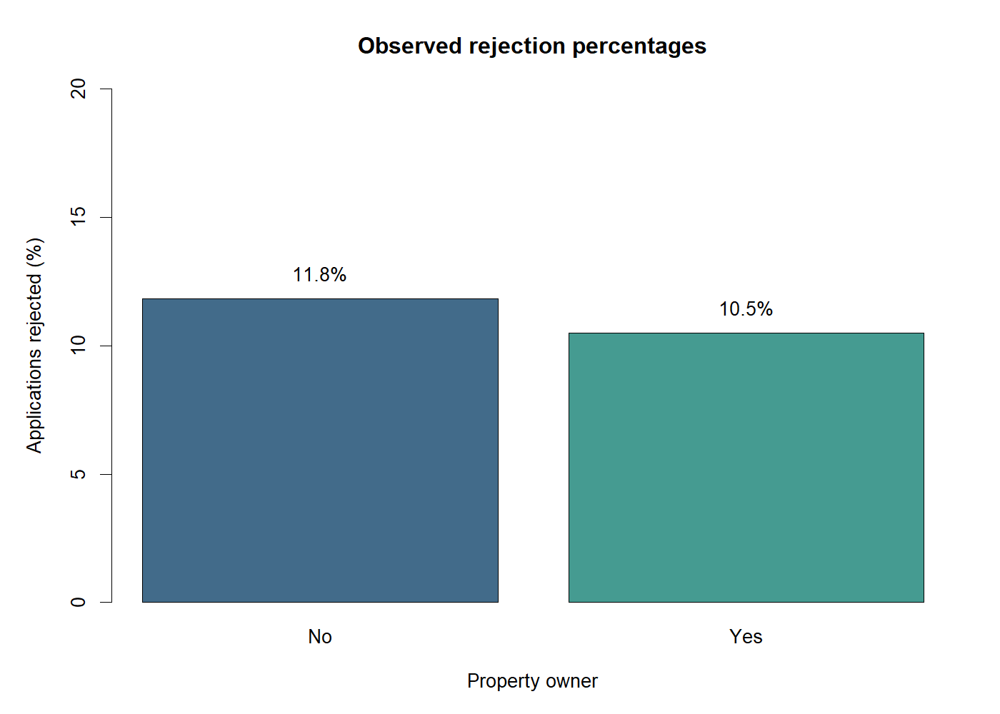
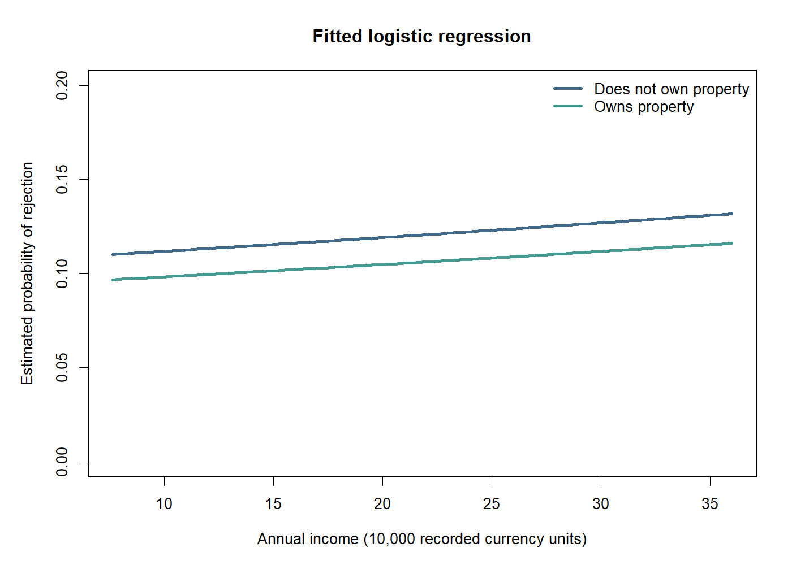

# Credit Card Application Analysis

A small R analysis for the SRM 611 reproducibility and GitHub activity.

## Purpose

Are annual income and property ownership associated with credit card application rejection? A logistic regression is used because the outcome has two categories.

## Data source

The data come from Rohit Udageri's [Credit card Details Binary Classification Problem](https://www.kaggle.com/datasets/rohitudageri/credit-card-details) on Kaggle (version 1, downloaded October 4, 2026). The dataset page lists a CC0 public-domain license. The two original CSV files are included in `data/`.

- `Credit_card.csv`: applicant characteristics.
- `Credit_card_label.csv`: application outcomes.

The files are joined using `Ind_ID`. Each joined row represents one applicant record. According to the Kaggle description, `label = 0` means approved and `label = 1` means rejected. `Propert_Owner` is the source's spelling for property ownership. The currency for annual income is not specified, so income is reported in recorded currency units.

## Repository files

- `analysis.R`: data preparation, summaries, logistic regression, and plots.
- `data/`: the two unchanged source CSV files.
- `results/analysis_output.txt`: sample counts, income summary, and model output.
- `results/odds_ratios.csv`: adjusted odds ratios and 95% Wald confidence intervals.
- `results/property_summary.csv`: observed rejection percentages by ownership.
- `results/rejection_by_property.png`: descriptive bar chart.
- `results/fitted_probabilities.png`: fitted probabilities from the model.
- `.gitignore`: excludes temporary R files and local archives.

## Run the analysis

1. Download this repository using **Code > Download ZIP**, then extract it.
2. Open `analysis.R` in RStudio.
3. Select **Session > Set Working Directory > To Source File Location**.
4. Click **Source** to run the complete script.

Alternatively, run `Rscript analysis.R` from the repository folder. Only base R is required; no additional packages need to be installed. The script was tested with R 4.5.1. It recreates all files in `results/`.

## Analysis and results

Both source files contain 1,548 unique applicant IDs, and all IDs match. Twenty-three records have missing annual income and are excluded. The final sample contains 1,525 applicants: 1,358 approved and 167 rejected (11.0%). Median annual income is 166,500 recorded units.

The model is `label ~ income_10000 + property`, where income is divided by 10,000 for interpretation and nonownership is the reference category.

| Predictor | Adjusted odds ratio | 95% confidence interval | p-value |
| --- | ---: | --- | ---: |
| Annual income, per 10,000 units | 1.007 | 0.995 to 1.020 | 0.266 |
| Owns property, compared with no property | 0.866 | 0.620 to 1.208 | 0.396 |

Holding property ownership constant, an additional 10,000 income units is associated with approximately 0.7% higher odds of rejection. Holding income constant, property owners have approximately 13.4% lower odds of rejection. However, both confidence intervals include 1 and both p-values exceed 0.05. This analysis does not provide clear evidence of an association for either predictor; it does not establish that the associations are zero.

Observed rejection percentages are 11.8% among nonowners (63 of 533) and 10.5% among owners (104 of 992). These percentages are unadjusted.

The fitted chart displays the middle 90% of observed incomes for readability. The model itself uses all 1,525 complete records. Lines show point estimates, not confidence bands.

## Limitations and a possible improvement

This is an exploratory association analysis, not a validated prediction tool. It assumes independent applicant records and a linear relationship between income and the log odds of rejection. Missing income may affect the results, and only two predictors are included. The source gives limited information about sampling and how outcomes were determined, so the results apply most directly to these records and do not establish causation. A larger project could add a dedicated data-cleaning script with documented checks before extending the model.
